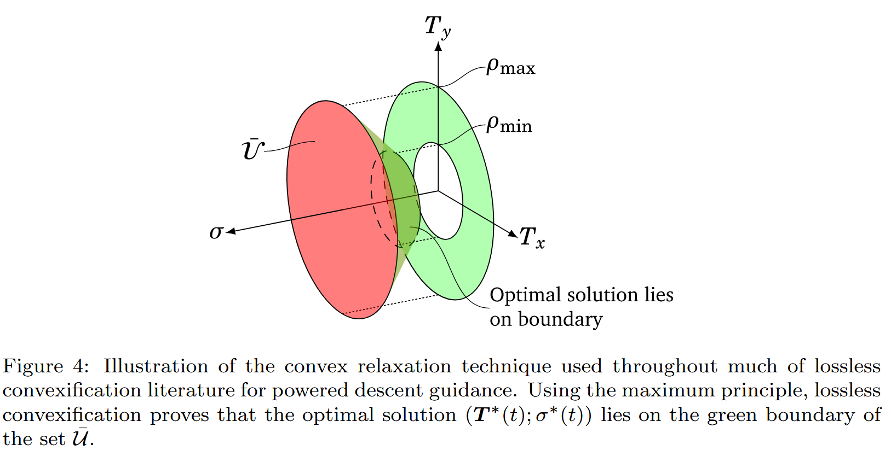

# Summary

The pin-point landing problem has been of significant interest for a long time however, up till now solving the problem in real-time has been infeasible as the problem is nonconvex. 
Previous approaches to solving the problem have been polynomial guidance which was famously used on the Apollo lunar lander however, this approach does not satisfy thrust constraints or non boundary-value state constraints. 
Alternatively a nonconvex optimisation problem could be solved however, this is slow, has no convergence guarantees and depends on good initial guesses. See @lys2018 for a literature review. 
The novelty of this paper, @aci2007, is to form an equivalent convex problem to the original problem. 
This means that we can solve the convex problem instead which is an important step towards real-time onboard computation of the optimal trajectory. 
To solve the convex problem, the paper discretises the problem and represents 'the control input by a finite set of basis vectors, which leads to a finite-dimensional convex  parameter optimization problem; more specifically it leads to a SOCP' (Second-order cone programming problem).

# Notation
$y \in [a, b]$ --- $y$ is in the range $a$ to $b$ inclusive, $a \leq x \leq b$

$\left \lVert y \right \rVert$ --- The length of vector $y$

$T_c(t)$ --- Thrust force acting on rocket at time t

$m(t)$ --- Mass of rocket at time t

$r(t)$ --- Position vector of spacecraft at time t relative to surface

$r_{0_1}$ --- is the component of $r_0$ along the direction opposite to the direction of gravity, i.e. $r_{0_1} = -\frac{g}{||g||} r_0$.

$r_1(t)$ --- is the component of $r(t)$ along the direction opposite to the direction of gravity, i.e. $r_1 = -\frac{g}{||g||} r(t)$.

$\dot{r}(t)$ --- Velocity vector of spacecraft at time t relative to surface

$\dot{r}_{0_1}$ --- is the component of $\dot{r}_0$ along the direction opposite to the direction of gravity, i.e. $\dot{r}_{0_1} = -\frac{g}{||g||} \dot{r}_0$.

$\ddot{r}(t)$ --- Acceleration vector spacecraft at time t relative to surface

$\; \forall \;$ --- for all

a.e. --- almost everywhere, for all elements in a set except for any elements also in another set of measure 0. Any finite set is measure.

$e_i$ --- a vector with $0$s everywhere except for the $i$th position where it is $1$.

identically zero --- when $f(x) = 0$ for all $x$ in the domain of $f(x)$.

# Problem Formulation

The paper assumes that:

- There is a uniform gravity field as the landing mission starts at a low altitude relative to planet's radius.
- Other forces such as aerodynamic forces are ignored and treated as disturbances
- The lander is a point mass, so we ignore rotational forces
  
The dynamics of the lander are expressed by:

\begin{align}
  \ddot{r}(t) &= g + \frac{T_c(t)}{m(t)} (\#eq:1) \\
  \dot{m}(t) &= - \alpha ||T_c(t)|| (\#eq:2)
\end{align}

The only two forces acting on the rocket are weight and the net thrust force. Additionally, the mass decreases proportionally to the magnitude of the thrust vector.

The magnitude of the net thrust vector is constrained by 
\begin{align*}
  0 < \rho_{1} \leq ||T_c(t)|| \leq \rho_{2} \; \forall \; t \in [0, t_f] (\#eq:3)
\end{align*}

The initial and final position and velocity, and the initial mass are specified,
\begin{align*}
  m(0) = m_{wet}, \hspace{1cm} r(0) &= r_0, \hspace{1cm} \dot{r}(0) = \dot{r}_0 (\#eq:4) \\
  r(t_{f}) = \dot{r}(t_{f}) &= 0 (\#eq:5)
\end{align*}
where $r_0, \dot{r}_0, m_{wet}$ are given.
Additionally the lander starts off above the surface and never goes below it, 
\begin{align*}
  r_{0_1} &> 0 (\#eq:6)\\ 
  r_{1}(t) &\geq 0, \ \ \; \forall \; t \in [0, t_{f}] (\#eq:7)
\end{align*}
where $r(t) = [r_1(t), r_2(t), r_3(t)]^T$
Any additional state constraints are assumed to have the general form of 
\begin{align*}
  ||S_j x(t) - v_j|| + c^T_j x(t) + a_j \leq 0, \hspace{1cm} j = 1, \ldots, n_s \hspace{.5cm} \forall \; t \in [0, t_f] (\#eq:8)
\end{align*}
where
\begin{align*}
  x = \begin{bmatrix}
  r \\
  \dot{r}
  \end{bmatrix} (\#eq:9)
\end{align*}
The paper imposes three inequalities in this form. constraint \@ref(eq:7) is written as
\begin{align*}
  [-1,\ 0,\ 0,\ 0,\ 0,\ 0] x \leq 0
\end{align*}
The second constraint is a bound on the velocity 
\begin{align*}
  || \dot{r}(t) || \leq \hat{V} \text{ for } t \in [0, t_f] (\#eq:10) \\
  \left \lVert [0,\ 0,\ 0,\ 1,\ 1,\ 1] x(t) \right \rVert - \hat{V} \leq 0
\end{align*}
The last constraint is a "glide slope" constraint ($\theta_{alt}$ is given)
\begin{align*}
  \theta_{alt} = \arctan \left( \frac{\sqrt{r_2(t)^2 + r_3(t)^2}}{r_1(t)} \right) \leq \tilde{\theta}_\text{alt} \leq \frac{\pi}{2} \\
  \text{So } \sqrt{r_2(t)^2 + r_3(t)^2} \leq r_1(t) \tan \tilde{\theta}_{alt}
\end{align*} 
which can be written using the following form of \@ref(eq:8) 
\begin{align*}
  ||Sx|| + c^T x \leq 0 (\#eq:11)
\end{align*} 
where 
\begin{align*}
  S = \begin{bmatrix}
  0 & 1 & 0 & 0 & 0 & 0 \\
  0 & 0 & 1 & 0 & 0 & 0
  \end{bmatrix}, \hspace{1cm}
  c = \begin{bmatrix}
  -\tan \tilde{\theta}_{alt} & 0 & 0 & 0 & 0 & 0
  \end{bmatrix}^T
\end{align*}
The "glide slope" constraint also enforces $r_1(t) \geq 0$, if $r_1(t) < 0$ then $c^T x \geq 0$ and so $||Sx|| \leq 0$ so $x = 0$ and $r_1(t) = 0$ which is a contradiction.

The glide slope constraint is slightly different in this paper compared to later papers, @bla2010, @aci2013, as $\theta_{alt}$ is the angle of the rocket from the vertical whilst the later papers measure the angle from the horizontal.^[Derivation for later papers: 
\begin{align*}
  \theta_{alt} = \arctan \left( \frac{r_1(t)}{\sqrt{r_2(t)^2 + r_3(t)^2}} \right) \leq \tilde{\theta}_\text{alt} \leq \frac{\pi}{2} \\
  \text{So } \sqrt{r_2(t)^2 + r_3(t)^2} \leq \frac{r_1(t)}{\tan \tilde{\theta}_{alt}}
\end{align*} and
\begin{align*}
  c = \begin{bmatrix}
    -\frac{1}{\tan \tilde{\theta}_{alt}} & 0 & 0 & 0 & 0 & 0
  \end{bmatrix}^T
\end{align*} ]

### Problem 1

Given the dynamics and constraints outlined above, the trajectory which maximises the final mass of the rocket (equivalent to minimising the loss in mass) is described as follows:

\begin{align*}
  \max_{t_f, T_c(\bullet)} m(t_f) &= \min_{t_f, T_c(\bullet)} \int_{0}^{t_{f}} ||T_c(t)|| dt \\
  \text{subject to } \ddot{r}(t) &= g + \frac{T_c(t)}{m(t)}, \hspace{1cm} \dot{m}(t) = - \alpha ||T_c(t)|| \\
  0 < \rho_{1} &\leq ||T_c(t)|| \leq \rho_{2}, \hspace{0.6cm} r_1(t) \geq 0 \\
  ||S_j x(t) - v_j|| &+ c^T_j x(t) + a_j \leq 0, \hspace{0.5cm} j = 1, \ldots, n_s \\
  m(0) = m_{wet}&, \hspace{0.8cm} r(0) = r_0, \hspace{0.9cm} \dot{r}(0) = \dot{r}_0 \\
  &\hspace{0.15cm} r(t_f) = \dot{r}(t_f) = 0
\end{align*}

The thrust magnitude constraint, inequality \@ref(eq:3), is a nonconvex constraint on the control input and so we need to deal with it in order to obtain a convex optimisation problem.

We will also add the constraint that $m(t) > 0$, the paper only adds this in Remark 8, I don't know why.
In @aci2008 they add the constraint $m(t_f) \geq 0$ to their problem, in @bla2010 they add the constraint $m(t_f) \geq m_{dry}$ and in @aci2013 they add $m(t_f) \geq m_{dry} > 0$

Thrust direction can also be constrained at the start and at the end of a manoeuvre  as 
\begin{align*}
  T_c(0) = ||T_c(0)|| \hat{n}_0, \hspace{1.5cm} T_c(t_f) = ||T_c(t_f)|| \hat{n}_f (\#eq:12)
\end{align*} 
where $\hat{n}_0$ and $\hat{n}_f$ are unit vectors describing the desired thrust directions.

# Convexification of the Control Magnitude Constraint

In this section the paper formulates a modified version of [Problem 1] and shows that an optimal solution of the modified problem is optimal for [Problem 1] and that it exists.

### Problem 2

The modified version of [Problem 1] is as follows:

\begin{align*}
  \min_{t_f, T_c(\bullet), \Gamma(\bullet)} \int_{0}^{t_f} \Gamma(t) \,&dt \hspace{1cm} \text{subject to } \dot{m}(t) = - \alpha \Gamma (t) (\#eq:13) \\
  &||T_c(t)|| \leq \Gamma(t) (\#eq:14) \\
  0 &< \rho_1 \leq \Gamma(t) \leq \rho_2 (\#eq:15) \\
  \ddot{r}(t) &= g + \frac{T_c(t)}{m(t)}, \hspace{1cm} r_1(t) \geq 0 \\
  ||S_j x(t) - v_j|| &+ c^T_j x(t) + a_j \leq 0, \hspace{1cm} j = 1, \ldots, n_s \\
  m(0) &= m_{wet}, \hspace{0.6cm} r(0) = r_0, \hspace{0.5cm} \dot{r}(0) = \dot{r}_0 \\
  &\hspace{0.15cm} r(t_f) = \dot{r}(t_f) = 0 
\end{align*}

[Problem 2] has introduced a slack variable $\Gamma$ which replaces $|| T_c ||$ and introduces a new constraint $\left \lVert T_c(t) \right \rVert \leq \Gamma(t)$. You can see in the figures below, how the control constraint has been mapped to a convex set.

```{r aci-control-constraint, echo = FALSE, fig.cap = "@aci2007", fig.align="center", out.width = "50%"}
knitr::include_graphics("images/Control_Constraint.png")
```
<!-- {width=75%} -->

```{r 2021-control-constraint, echo = FALSE, fig.cap = "@mal2021", fig.align="center"}

```

<!-- 
```{r image-ref-for-in-text, echo = FALSE, message=FALSE, fig.align='center', fig.cap='Some cool caption', out.width='200\\linewidth', fig.pos='H'}
knitr::include_graphics("./images/Control_Constraint.png")
```
-->

A solution to [Problem 1] is clearly a feasible solution of [Problem 2] as we can simply set $\Gamma(t) = ||T_c(t)||$, however the converse needs to be proved and so below it wil be shown that an optimal solution of [Problem 2] is also an optimal solution of [Problem 1], which allows us to solve [Problem 1] by solving the convex [Problem 2]. 

::: {.lemma #one}
Consider a solution of [Problem 2] given by $[t_f^*, T_c^*(\bullet), \Gamma^*(\bullet)]$^[
  such that the corresponding state trajectory satisfies $x^*(t) \in \operatorname{int} X \; \forall \; t \in (0, t_f^*)$($X$ here enforces all three state constraints, so $X = \{x \in \mathbb{R}^6: ||Sx|| + c^T x \leq 0 \text{ and } || \dot{r}(t) || \leq \hat{V} \}$). 
  This condition was added in @bla2010 and the appendix extends the result to when $r^*(t)$ touches the boundary at one point $t \in (0, t_f^*)$.
  <!-- I've tried to incorporate the velocity constraint idk if this right. As we haven't added the constraint $r(t) \in X$, I don't think the condition is necessary. Actually we have $r_1(t) \geq 0$. -->]. 
Then, $[t_f^*, T_c^* (\bullet)]$ is also a solution of [Problem 1] and $||T_c^*(t)|| = \rho_1$ or $||T_c^*(t)|| = \rho_2$ for $t \in [0, t_f^*]$.
:::

You might want to check out my [notes](/post/pontryagin) on Pontryagin's principle first if you don't already understand it.

::: {.proof}
Let $y = [x^T,\ m]^T$ and $x = [x_1^T, x_2^T] = [r, \dot{r}]$, then $\dot{y} = [x_2,\ g + T_c / m,\ - \alpha \Gamma]^T$. The Hamiltonian for [Problem 2] is 
\begin{align*}
  H(x, m, T_c, \Gamma, \lambda_0, \lambda) &= \lambda_0 \Gamma  + \lambda^T \dot{y} \\
  &= \lambda_0 \Gamma + \lambda_1^{T} x_2 + \frac{\lambda^T_2 T_c}{m} + \lambda^T_2 g - \alpha \lambda_3 \Gamma (\#eq:16)
\end{align*}
with $\lambda_0 \leq 0$.

The set of control constraints $\Psi$ is $\left\{ (T_c, \Gamma) : ||T_c(t)|| \leq \Gamma(t),\ \rho_1 \leq \Gamma(t) \leq \rho_2 \right\}$ is a fixed set (I think this means it doesn't vary with time, as in it only depends on $\Gamma(t)$ and $T_c$ and not $t$ as well).

Let $v = [T_c^T,\ \Gamma]^T$, then there exist a $\lambda_0 \leq 0$ and an absolutely continuous function^[https://math.stackexchange.com/questions/191268/absolutely-continuous-functions seems like a nice description of what an absolutely continuous function is] $\lambda$ such that

1. $[\lambda_0,\ \lambda^T]^T \neq 0 \; \forall \; t \in [0,\ t^*_f]$ and
\begin{align*}
  \dot{\lambda} = -\frac{\partial H}{\partial y} \left( y^*,\ v^*,\ \lambda_0,\ \lambda \right) (\#eq:17)
\end{align*} 

2. *Pointwise maximum principle* given below must be satisfied
\begin{align*}
  H(y^*(t),\ v^*(t), \lambda_0, \lambda) \geq H(y^*(t),\ v, \lambda_0, \lambda) \hspace{0.3cm} \; \forall \; v \in \Psi \hspace{0.3cm} \text{a.e. on } t \in [0, t^*_f] (\#eq:18)
\end{align*} 

Simply put the Hamiltonian must be maximised with respect to $v$ at all times.

3. The following *transversality condition* must be satisfied: Let $\psi = [y^{*^T}, v^{*^T}, \lambda_0, \lambda^{T} ]^{T}$, then $[ H(\psi(0)),\ -\lambda(0)^T,\ -H(\psi(t^*_f)),\ \lambda(t_f^*)^T ]^T$ must be orthogonal to the set of feasible initial and final conditions $[0, y(0), t_f, y(t_f) ]$ at the point $[ 0,\ y^*(0)^T,\ t_f^*,\ y^*(t_f^*)^T ]$.
:::

Starting with the first necessary condition \@ref(eq:17), we can see that ^[Check out comments of answer at https://math.stackexchange.com/questions/3270789/partial-derivative-of-a-dot-product-with-respect-to-one-of-its-vectors to see why $\frac{d}{d x_2} \lambda_1^T x_2 = \lambda_1$]
 \begin{align*}
  \frac{\partial H}{\partial y} \left( y^*,\ v^*,\ \lambda_0,\ \lambda \right) &= [
    0,\ \lambda_1,\ \lambda_2^T T^*_c * -\frac{1}{m^2}
  ]^T \\
  \therefore \dot{\lambda}_1 &= 0 (\#eq:19) \\ 
  \dot{\lambda}_2 &= -\lambda_1 (\#eq:20) \\ 
  \dot{\lambda}_3 &= \frac{1}{m^2} \lambda_2^T T^{*}_{c} 
\end{align*} 

Now onto the transversality condition, let us first construct the set of feasible initial and final conditions $\left[0,\ y(0),\ t_f,\ y(t_f) \right]$. 
We know $y(0)$ is the point $[r_0, \dot{r}_0, m_{wet}]^T$ and $y(t_f) = [0, 0, 0, 0, 0, 0, m(t_f)]$^[You may note that $x(t_f)$ can be anything as long as it is a point @bla2010], so the the only values in the set that can vary are $t_f$ and $m(t_f)$. 
If a vector is orthogonal to a set at a point, it's dot product with the tangent vectors to the set at the point will be 0. 
The tangent vectors to the set are 
\begin{align*}
  \left. \frac{\partial}{\partial t_f} \right|_{t_f=t_f^*} \left[0, y(0), t_f, y(t_f) \right] = e_9, \hspace{0.5cm} \left. \frac{\partial}{\partial m(t_f)} \right|_{m(t_f)=m(t_f^*)} \left[0, y(0), t_f, y(t_f) \right] = e_{16}
\end{align*}
So 
\begin{align*}
  [ H(\psi(0)),\ -\lambda(0)^T,\ -H(\psi(t^*_f)),\ \lambda(t_f^*)^T ]^T \cdot e_9 = 0
\end{align*} 
giving $-H(\psi(t^*_f)) = 0$ ^[note $\lambda_1$ and $\lambda_2$ have three elements ($\lambda_{1, 2} \in \mathbb{R}^3$) whilst $\lambda_3$ only has one ($\lambda_3 \in \mathbb{R}$)] and similarly $\lambda_3(t^*_f) = 0$.

Now we will show by contradiction that the statement $\lambda_2(t) = 0 \; \forall \; t \in [0, t_f^*]$ is false. Let's assume the statement is true, then $\dot{\lambda}_3 = 0$ and we know $\lambda_3(t_f^*) = 0$ so $\lambda_3 = 0$. We also know $\dot{\lambda}_2 = 0$ if it is always 0 and so $\lambda_1 = 0$. Since $H(\psi(t_f^*)) = \lambda_0 \Gamma = 0$, $\lambda_0 = 0$ which violates the first necessary condition $[\lambda_0,\ \lambda^T]^T \neq 0 \; \forall \; t \in [0,\ t^*_f]$. Therefore the statement is false.

As $\lambda_1$ is a constant, $\lambda_2 = -\lambda_1 t + a$ for some constant a. As we know $\lambda_2$ is not identically zero then $\lambda_2$ can be zero, at most, at one point on $[0, t_f^*]$.

We can express the Hamiltonian as 
\begin{align*}
  H(x, m, T_c, \Gamma, \lambda_0, \lambda) = R_1(t) \Gamma + R_2(t)^T T_c + R_0(t) (\#eq:21)
\end{align*} 
where 
\begin{align*}
  R_0(t) = \lambda_1(t)^T x_2(t) + \lambda_2(t)^T &g, \hspace{1cm} R_1(t) = \lambda_0 -\alpha \lambda_3(t) \\
  R_2(t) &= \frac{\lambda_2(t)}{m(t)}
\end{align*} 

To maximise the Hamiltonian per the pointwise maximum principle \@ref(eq:18) we want to maximise $R_2(t)^T T_c(t) = ||R_2(t)|| \ ||T_c(t)|| \cos \theta(t)$, we want to maximise $||T_c(t)|| \cos \theta(t)$ unless $||R_2(t)|| = 0$. 
$||R_2(t)|| = 0$ iff $\lambda_2(t) = 0$ as $m^*(t) \neq 0$ and because $\lambda_2(t) \neq 0$ a.e. on $t \in [0, t_f^*]$ then we want to maximise $||T_c(t)|| \cos \theta$ a.e. on $t \in [0, t_f^*]$. 
So we want to maximise $||T_c(t)||$ as long as $\cos \theta(t) > 0$.
As we can choose $\theta(t)$ without constraint for $t \in (0, t^*_f)$^[The start/end constraints determine $\theta$ at those times], we choose $\cos \theta(t) = 1$ for all $t \in (0, t^*_f)$. 
The maximum of $||T_c(t)||$ is $\Gamma(t)$ per $\Psi$ so 
\begin{align*}
  ||T^*_c(t)|| &= \Gamma^*(t) \text{ a.e. on } [0, t^*_f] (\#eq:22)\\
  T^*_c &= \frac{R_2}{||R_2||} \Gamma^* \text{ a.e. on } t \in [0, t_f^*] \ (\text{as } ||R_2|| \neq 0 \text{ a.e. on } [0, t_f^*]), \\
  \rho_1 &\leq ||T^*_c(t)|| \leq \rho_2 \text{ a.e. on } t \in [0, t_f^*]
\end{align*}

Therefore an optimal solution of [Problem 2] satisfies all the constraints of [Problem 1] and the objective function is the same so it also defines an optimal solution for [Problem 1].

Now we will show that $||T_c^*(t)|| = \rho_1$ or $||T_c^*(t)|| = \rho_2$ for any $t \in [0, t_f^*]$ by using the pointwise maximum principle. 
We can now see that ^[$\cos \theta = 1$ except when start/end constraints are binding]
\begin{align*}
  H(x, m, T_c, \Gamma, \lambda_0, \lambda) &= H(\psi(t)) = R_{12}(t) \Gamma + R_0(t), \\
  \text{ where } R_{12}(t) &= R_1(t) + ||R_2(t)||
\end{align*}

The pointwise maximum principle implies that 
\begin{align*}
  \Gamma^*(t) =
  \begin{cases}
    \rho_1, & \text{if } R_{12}(t) < 0 \\
    \rho_2, & \text{if } R_{12}(t) > 0
  \end{cases}
\end{align*} 
We can ignore the $R_{12}(t) = 0$ case as we can show that $R_{12}(t) \neq 0$ a.e. on $t \in [0, t_f^*]$.

As $R_1(t) = \lambda_0 - \alpha \lambda_3(t)$ we note that 
\begin{align*}
  \dot{R}_1(t) &= -\alpha \frac{1}{m^2}\lambda_2^T T^*_c \\
  &= - \frac{\alpha}{m} R_2^T T^*_c \\
  &= - \frac{\alpha}{m} R_2^T \frac{R_2}{||R_2||} \Gamma^* \\
  &= - \frac{\alpha}{m} ||R_2|| \Gamma^*
\end{align*}

Also by noting that $||R_2|| = \frac{||\lambda_2||}{m}$ (as $m > 0$) note that
\begin{align*}
  \frac{d ||R_2||}{d t} &= \frac{1}{m} \frac{d ||\lambda_2||}{d t} - \frac{\dot{m}}{m^2} ||\lambda_2|| \\
  &= \frac{1}{m} \frac{d ||\lambda_2||}{d t} + \frac{\alpha \Gamma^*}{m^2} ||\lambda_2|| \\
  &= \frac{1}{m} \frac{d ||\lambda_2||}{d t} + \frac{\alpha}{m} ||R_2|| \Gamma^*
\end{align*} 

So \begin{align*}
  m \dot{R}_{12} &= m\dot{R}_1 + m \dot{||R_2||} \\
  &= - \alpha ||R_2|| \Gamma^* + \frac{d ||\lambda_2||}{d t} + \alpha ||R_2|| \Gamma^* \\
  &= \frac{d ||\lambda_2||}{d t} \\
  &= -\frac{\lambda_2^T}{||\lambda_2||} \lambda_1 \\
  &= -\frac{1}{||\lambda_2||} (-\lambda_1 t + a)^T \lambda_1 \\
  &= \frac{1}{||\lambda_2||} (\lambda_1^T \lambda_1 t - a^T \lambda_1) \\
  &= \frac{1}{||\lambda_2||} (||\lambda_1||^2 t - \lambda_1^T a)
\end{align*} ^[\begin{align*}
  \text{let } \lambda_2(t) &= [f_1(t), f_2(t) \ldots f_n(t)] \\
  \frac{d ||\lambda_2||}{d t} &= \frac{d }{d t} \sqrt{\sum f_i(t)^2 } \\
  &= \frac{1}{2} \frac{1}{||\lambda_2||} ( 2 f_1(t) \dot{f}_1(t) + 2 f_2(t) \dot{f}_2(t) + \dots + 2 f_n(t) \dot{f}_n(t) ) \\
  &= \frac{\lambda_2^T}{||\lambda_2||} \dot{\lambda}_2
\end{align*}
I'm not sure where the half has come from in the paper.]
where $\lambda_1$ and $a$ are constant vectors and they cannot both be zeros as that would imply that $\lambda_2$ is identically 0 and we know this to be false.

If $\lambda_1 \neq 0$ then $m \dot{R}_{12}$ is not identically 0 and as $m \neq 0$ we know $\dot{R}_{12}$ is not identically 0. When $\lambda_1 \neq 0$, we can see that $\frac{d}{dt} m \dot{R}_{12} = \frac{||\lambda_1||^2}{||\lambda_2||} > 0$, so $m\dot{R}_{12}$ can only be zero at one point and the sign can only change from negative to positive. As $m > 0$ the sign of $\dot{R}_{12}$ is the same as $m\dot{R}_{12}$, there can only be two points at maximum where $R_{12} = 0$ so $R_{12} \neq 0$ a.e. on [0, t_f] when $\lambda_1 \neq 0$.

Note that $\dot{R}_{12} = 0$ on some interval $[t_a, t_b]$ which is a subset (don't think it has to be strict) of $[0, t_f]$ only if $\lambda_1 = 0$. If $\lambda_1 = 0$ then $\dot{R}_{12} = 0 \; \forall \; t \in [0, t_f]$, so to show $R_{12} \neq 0$ we still need to show that $R_{12}$ is not identically 0 when $\lambda_1 = 0$. To do this, suppose that $R_{12}$ is identically 0 when $\lambda_1 = 0$. This implies $\lambda_2$ is constant in time and 
\begin{align*}
  H(\psi(t_f^*)) = R_0(t) + R_{12}(t)\Gamma^*(t) = R_0(t) = 0 \\
  R_0(t) = \lambda_1(t)^T x_2(t) + \lambda_2(t)^T g = g^T \lambda_2(t) = 0
\end{align*}

Since $T_c^* = \frac{R_2}{||R_2||}\Gamma^* = \frac{\lambda_2}{||\lambda_2||} \Gamma^*$ then $g^T T_c^* = g^T \lambda_2 \frac{R_2}{||\lambda_2||} = 0$.

Recall $\ddot{r}(t) = g + \frac{T_c(t)}{m(t)}$, where $g$ is a constant and $\frac{T_c^*(t)}{m(t)} = \frac{\Gamma^*(t)}{m(t)} \hat{n}$ is always pointing in the direction of $\hat{n}$, letting $\hat{n} = \frac{\lambda_2}{||\lambda_2||}$ which is a constant. The $\frac{T_c^*(t)}{m(t)}$ component will therefore only affect velocity in the $\hat{n}$ direction. Therefore $\dot{r}(t) = g t + \beta(t) \hat{n} + \dot{r}_0$
^[
\begin{align*}
  \dot{r}(t) - \dot{r}_0 &= g (t - 0) + \int_{0}^{t} \frac{\Gamma^*(s)}{m(s)} \hat{n} \,ds\\
  \text{remember }\dot{m} &= - \alpha \Gamma(t) \\
  &= g t - \int_{0}^{t} \frac{\dot{m}(s)}{m(s)} \frac{\hat{n}}{\alpha} \,ds \\
  &= g t - \frac{\hat{n}}{\alpha}  \int_{0}^{t} \frac{\dot{m}(s)}{m(s)} \,ds \\
  &= g t - \frac{\hat{n}}{\alpha}  \ln \frac{m(t)}{m(0)}
\end{align*} 
You will notice this is the same as the [rocket equation](https://en.wikipedia.org/wiki/Tsiolkovsky_rocket_equation#Acceleration-based) with $R(t) = -\alpha \Gamma(t)$ and $v_e = \frac{1}{\alpha}$.
] 
and so $\dot{r}(t_f) = g t_f + \beta_2 \hat{n} + \dot{r}_0 = 0$. Integrating $\dot{r}(t)$ we get $r(t) = r_0 + \dot{r}_0 t + g \frac{t^2}{2} + B(t) \hat{n}$.
^[
  \begin{align*}
    r(t) - r_0 = \dot{r}_0 (t - 0) + g \frac{(t - 0)^2}{2} + \frac{\hat{n}}{\alpha} 
  \end{align*} 
I don't know what to do from here.
]
So $r(t_f) = r_0 + \dot{r}_0 t_f + g \frac{t_f^2}{2} + \beta_1 \hat{n} = 0$.

Recall $g^T T_c^* = 0$ and $T_c^* = \Gamma^* \hat{n}$ so $g^T \hat{n} = 0$. Then 
\begin{align*}
  -\frac{g^T}{||g||} \dot{r}(t_f) &= -||g|| t_f - \frac{g^T}{||g||} \beta_2 \hat{n} - \frac{g}{||g||} \dot{r}_0 \\
  &= -||g|| t_f + \dot{r}_{0_1} \\
  &= 0 ,
\end{align*} 
remember $\dot{r}_{0_1} = -\frac{g^T}{||g||} \dot{r}_0$. 
Also 
\begin{align*}
  -\frac{g^T}{||g||} r(t_f) &= r_{0_1} + \dot{r}_{0_1} t_f - ||g|| \frac{t_f^2}{2} \\
  &= 0 ,
\end{align*} 
remember $r_{0_1} = -\frac{g^T}{||g||} r_0$.

\begin{align*}
  \dot{r}_{0_1} &= ||g|| t_f \geq 0\\
  r_{0_1} &= ||g|| \frac{t_f^2}{2} - \dot{r}_{0_1} t_f  \\ 
  &= ||g|| \frac{t_f^2}{2} - ||g|| t_f \\
  &= -||g|| \frac{t_f^2}{2} \\
  &= -\frac{\dot{r}_{0_1}^2}{2||g||} \leq 0
\end{align*}
Recall we assumed $r_{0_1} > 0$ in \@ref(eq:6), which leads to a contradiction. 
Therefore, $R_{12}(t) \neq 0 \; \forall \; t \in [0, t_f]$ when $\lambda_1 = 0$ and so $R_{12}(t) \neq 0$ a.e. on $[0, t_f^*]$.

The proof of Lemma \@ref(lem:one) is thus complete. Lemma \@ref(lem:one) implies that main nonconvex constraint on the thrust magnitude \@ref(eq:3) in [Problem 1] is convexified by replacing it with \@ref(eq:14) and \@ref(eq:15) in Problem 2 via the introduction of a slack variable $\Gamma$. Furthermore, Lemma \@ref(lem:one) states that if there exists and optimal solution for [Problem 2], then there also exist one for [Problem 1] and it can be obtained directly from the optimal solution of [Problem 2].

To add the start/end thrust direction constraints \@ref(eq:12) to [Problem 2] we use \@ref(eq:22) to get the constraints 
\begin{align*}
  T_c(0) = \Gamma(0) \hat{n}_0, \hspace{1cm} T_c(t_f) = \Gamma(t_f) \hat{n}_f (\#eq:23)
\end{align*}
 
## Existence of an Optimal solution

Now before we try to solve [Problem 2] to obtain an optimal solution, we have to first make sure that an optimal solution exists.

:::{.theorem #one}
Consider the following optimal control problem: 
\begin{gather*}
  \min_{v(\bullet)} J(y(\bullet), u(\bullet), t_f) = \int_{0}^{t_f} g(y(t), u(t)) \,dt \\
  \text{subject to $\dot{y}(t) = f(y(t), v(t))$} \\ \\
  y(t) \in \mathcal{Y} \quad \text{ and } \quad v(t) \in \mathcal{V} \; \forall \; t \in [0, t_f] \\
  y(0) \in B_0 \quad \text{ and } \quad y(t_f) \in B_f
\end{gather*} 
There are 5 conditions that need to be satisfied for an optimal solution to exist, if there exist feasible state trajectories and control signals:

1. There exists a compact set $\mathcal{R}$ such that all feasible state trajectories satisfy $[t, y(t)] \in \mathcal{R}$ for all $t \in [0, t_f]$
2. The set of all feasible $[y(0), t_f, y(t_f)]$, such that $y(0) \in B_0$ and $y(t_f) \in B_f$, is closed
3. The set $\mathcal{V}$ is compact
4. $[g, f^T]^T$ is a continuous function for $y \in \mathcal{Y}$ and $v \in \mathcal{V}$
5. for each $(t, y) \in \mathcal{R}$, $Q^+(t, y)$ is convex, where 
\begin{align*}
  Q^+(y) = \{ (z_1, z_2): z_1 \geq g(y, v), z_2 = f(y, v), v \in \mathcal{V} \} (\#eq:24)
\end{align*} 
:::

## Brief Interlude - Boundary Value Problem

When using the Pontryagin's principle you may solve a two-point boundary-value problem to obtain the optimal control. I lay it out below.

We have $x = [r, \dot{r}, m]$ where $r \in \mathbb{R}^3$ and $m \in \mathbb{R}$. We also have $\lambda = [\lambda_1, \lambda_2, \lambda_3]$ where $\lambda_1, \lambda_2 \in \mathbb{R}^3$ and $\lambda_3 \in \mathbb{R}$. $g$ is the gravity vector and $\alpha$ is a given scalar coefficient.
\begin{align*}
  \dot{x} &= \begin{bmatrix}
  \dot{r} \\
  g + \frac{\lambda_2}{||\lambda_2||} \Gamma \\
  - \alpha \Gamma
  \end{bmatrix} \\
  \dot{\lambda} &= - \begin{bmatrix}
    \boldsymbol 0 \\
    \lambda_1 \\
    ||\lambda_2|| \Gamma / m^2
    \end{bmatrix}
\end{align*} 
where \begin{align*}
  R_{12}(t) = \lambda_0 - \alpha \lambda_3 + \frac{||\lambda_2||}{m} \\
  \Gamma(t) =
  \begin{cases}
    \rho_1, & \text{if } R_{12}(t) < 0 \\
    \rho_2, & \text{if } R_{12}(t) > 0
  \end{cases}
\end{align*} 
$x(0)$ is given and $r(t_f), \dot{r}(t_f) = \boldsymbol 0$, where $t_f$ is the final time, it is free and $t_f > 0$. Also $\lambda_3(t_f) = 0$, $H(t_f) = \lambda_0 \Gamma + \lambda^T \dot{x} = 0$, $\lambda_0 = 0$ or $-1$ and $\lambda \neq 0$ for all $t \in [0, t_f]$.

Unfortunately, I have found that solving this problem seems difficult. I tried using the bvp4c solver in matlab which complained about a singular jacobian matrix even if I gave the analytic jacobian. I also used a few different solvers in julia which would give a result that didn't satisfy the boundary constraints or would complain about dt <= dtmin. I've given up on trying to numerically solve it, I just thought it would be much simpler than what the paper did but I have no experience with numerical methods in general. I figure I need to give it a better initial guess for the adjoint equations or the bang bang control is giving problems.

Additionally, I have found the following quote 'solving the resulted two-point boundary value problem is a difficult task, and good initial guesses of the adjoint variables can be difficult to find or compute' @lys2018, which backs up my experience. Also, 'issues that hinder onboard implementation include poor convergence stemming from a sensitivity to the initial guess, and long computation time.' @mal2021

## Change of Variables

In this section a change of variables is introduced to remove the nonlinear state dynamics due to $\frac{T_c}{m}$ @bla2010 @aci2013.

I don't think I am going to make notes on the rest of this paper or the following papers as I was able to skim it well enough to implement the results for a rocket with solid motors.

Note Nonlinear Optimal Control Theory by Leonard David Berkovitz, Negash G. Medhin is the sequel to citation 23 in @aci2007

# References