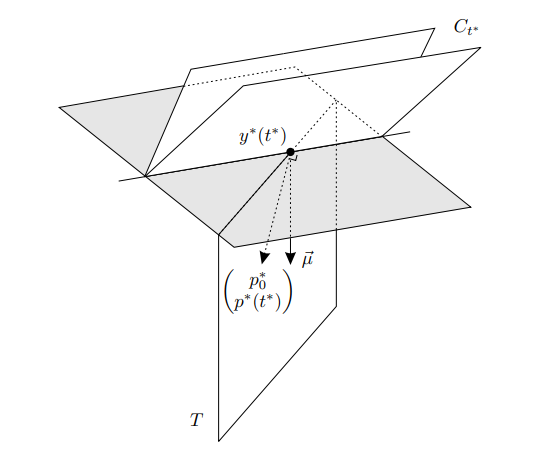

# Statement of Pontryagin’s principle

Consider the Bolza problem (@bolza)
\begin{gather*}
  \min_{u(t), t_0, t_f, x(t_0)} K(t_0, x(t_0), t_f, x(t_f)) + \int_{t_0}^{t_f} L(x(t), u(t), t) \\
  \text{s.t. } \dot{x}(t) = f(x(t), u(t), t),\ (t_0, x(t_0), t_f, x(t_f)) \in \mathcal{B},\ u(t) \in U.
\end{gather*}
$x$ is commonly referred to as the state and $u$ the control.
$f$ encodes the dynamics of the state, $K$ is an initial/terminal cost and $L$ is the running cost.
The initial time and state and terminal time and state are constrained as they have to lie in $\mathcal{B}$ whilst the control lies in $U$.

Pontryagin’s principle is a set of necessary conditions for an optimal solution to this problem.

The Bolza problem can easily be converted into one with $L \equiv 0$^[i.e. $L = 0$ always], a Mayer problem, or one with $K \equiv 0$, a Lagrange problem (see @bolza or @lib2012 on how to do this).
The time dependence in the dynamics and the cost can also be easily incorporated into the state by augmenting the state with a variable representing time.

This reformulated problem is stated as follows, where $x$ is the augmented state and $L$ the augmented cost
\begin{gather*}
  \min \int_{t_0}^{t_f} L(x, u) \\
  \text{s.t. } \dot{x} = f(x, u),\ (x(t_0), x(t_f)) \in \mathcal{B},\ u \in U
\end{gather*} 

Pontryagin’s principle for this problem is as follows, @ber2013 (page 170). Let $x(t), u(t), t_0, t_f$ be the optimal solutions to the problem then:

(i) There exists an absolutely continuous function $\hat{\lambda}(t) = (\lambda_0, \lambda(t))$ defined on $[t_0, t_f]$ such that $\lambda_0$ is either $-1$ or $0$, and $\hat{\lambda} \neq \boldsymbol 0$ for all $t \in [t_0, t_f]$.
Then we can define the Hamiltonian, $H$, to be $H\left( x, u, \hat{\lambda} \right) = \lambda(t) \cdot f(x(t), u(t)) + \lambda_0 L(x, u)$.

(ii) 
\begin{gather*}
  \dot{\lambda}(t) = -\nabla_x H\left( x(t), u(t), \hat{\lambda}(t) \right)
\end{gather*} 

(iii)
\begin{gather*}
  H(x(t),\ u(t),\ \hat{\lambda}(t)) \geq H(x(t),\ w,\ \hat{\lambda}(t)) \hspace{0.3cm} \; \forall \; w \in U \hspace{0.3cm} \text{a.e. on } t \in [t_0, t_f]
\end{gather*} 
Simply put the Hamiltonian must be maximised with respect to $u$ at all times^[a.e. means all most everywhere, we can take this to be equivalent to for all for our purposes. What it actually means is that the condition may not hold for a set of values that is of measure $0$, e.g. for a a finite set of values].

(iiii)
The following *transversality condition* must be satisfied: Let $\psi(t) = [x(t), u(t), \hat{\lambda}(t) ]$, then $[ H(\psi(t_0)),\ -\lambda(t_0),\ -H(\psi(t_f)),\ \lambda(t_f) ]$ must be orthogonal to the tangent space to $\mathcal{B}$ at the point $[ t_0,\ x(t_0),\ t_f,\ x(t_f) ]$^[I.e. $[ H(\psi(t_0)),\ -\lambda(t_0),\ -H(\psi(t_f)),\ \lambda(t_f)] \cdot d = 0 \quad \forall \; d \in T_{[ t_0,\ x(t_0),\ t_f,\ x(t_f) ]} \mathcal{B}$].
It follows then if we can vary the initial time freely then $H(\psi(t_0)) = 0$ and similarly if we can vary the final time $H(\psi(t_f)) = 0$.

It is shown in @lib2012 that the Hamiltonian is a constant with respect to time.

There are many different proofs for Pontryagin’s principle depending on if we have initial/ target sets and what assumptions we make, e.g. do we assume everything is differentiable or not?

An example where Pontryagin’s principle has been applied is the [pin-point landing problem](/post/gfold-2007).

# Proofs

I will outline some different proofs below.

## Dynamic Programming

There is the dynamic programming approach in @ber2017 or @lib2012.

## Quick Proof
Let's say our problem is 
\begin{gather*}
  \min K(x(T)) \\
  \text{s.t. } \dot{x}(t) = f(x(t), u(t)), \ u(t) \in U
\end{gather*} where I believe $T$ is either fixed or free.

If we have trajectories $(x_\epsilon, u_\epsilon)$ which are a variation of the optimal trajectories $(x^*, u^*)$ with $\epsilon \geq 0$ and \begin{gather*}
  \lim_{\epsilon \to 0^+} (x_\epsilon, u_\epsilon) = (x^*, u^*) 
\end{gather*}^[The trajectories approach the optimal trajectories as we decrease $\epsilon$]
Now, we know a small increase in $\epsilon$ at $\epsilon=0$ must increase the objective function. Therefore
\begin{gather*}
  0 \leq \left. \frac{\partial}{\partial \epsilon} \right|_{\epsilon=0^+} K(x_\epsilon(T)) = \nabla K(x^*(T)) \left. \frac{\partial}{\partial \epsilon} \right|_{\epsilon=0^+} x_\epsilon(T)
\end{gather*} 
Let $\lambda(T) = - \nabla K(x^*(t))$ and $v(t) = \left. \frac{\partial}{\partial \epsilon} \right|_{\epsilon=0^+} x_\epsilon(t)$. So $\lambda(T) v(T) \leq 0$

We want to show $\lambda(t)f(x^*, u^*) \geq \lambda(t)f(x^*, w)$ for all $w \in U$ and $t \in [0, T]$. If we construct $v(t) = f(x^*, w) - f(x^*, u^*)$ then we can see the statement is true when $t = T$. Additionally if we can show $\lambda(t)v(t)$ has the same sign for all $t \in [0, T]$ then we see the desired results follows.

We consider control ``perturbations that may be large in magnitude by are confined to small time intervals. The net effect on the trajectory of such perturbations will then be small'' @hoc1991. 
It turns out we can use a type of variation called a needle variation which is defined as:
\begin{align*}
  u_\epsilon(t) = \begin{cases}
    \omega & \text{if } t \in [\tau - \epsilon, \tau] \\
    u^*(t) & \text{else}
  \end{cases} 
\end{align*} 
where $\tau \in (0, T]$ and $0 < \tau - \epsilon < \tau$ and $\omega \in U$.
Importantly it is possible to differentiate along a needle variation and they are simple @dmi2016.

```{r needle, echo = FALSE, fig.cap = "@aro123", fig.align="center", out.width = "50%"}

```

Let $x_\epsilon(t)$ be the corresponding response to our system:
\begin{align*}
  \dot{x}_\epsilon(t) &= f(x_\epsilon(t), u_\epsilon(t)) \\
  x_\epsilon(0) &= x^*(0)
\end{align*}

We want to understand how our choices of $\tau$ and $\omega$ cause $x_\epsilon(t)$ to differ from $x^*(t)$ for small $\epsilon > 0$.

For $t \geq \tau$ both $x^*(t)$ and $x_\epsilon(t)$ follow $u^*(t)$ so they solve the same ODE but with differing initial conditions.

Clearly $x_\epsilon(t) = x^*(t)$ for $0 \leq t \leq \tau - \epsilon$ and  $x_\epsilon(\tau) = x^*(\tau) + \epsilon v(\tau) + o(\epsilon)$^[For any function with a derivative at $t$ we know $x(t + h) = x(t) = h x'(t) + o(h)$]. We also get $v(\tau) = \left. \frac{\partial}{\partial \epsilon} \right|_{\epsilon=0^+} x_\epsilon(\tau) = f(x^*(\tau), \omega) - f(x^*(\tau), u^*(\tau))$ from @lib2012 or @aro123.

Also,
\begin{align*}
  \dot{x}_\epsilon(t) &= \dot{x}^*(t) + \epsilon \dot{v}(t) \ \ \text{ for } t \geq \tau \\
  \dot{x}_\epsilon(t) &= f(x_\epsilon(t), u^*(t)) \text{ for } t \geq \tau  \\
  &= f(x^*(t) + \epsilon v(t) + o(\epsilon), u^*(t)) \\
  &\approx f(x^*(t), u^*(t)) + \epsilon v(t) \nabla_x f(x^*(t), u^*(t)) \\
  &= \dot{x}^*(t) + \epsilon v(t) \nabla_x f(x^*(t), u^*(t)) \\
  \therefore \dot{v}(t) &= v(t) \nabla_x f(x^*(t), u^*(t))
\end{align*} 

We let $v(t) = 0$ for $0 \leq t < \tau$, $v(t)$ represents the difference between $x_\epsilon$ and $x^*$ after the needle perturbation stops acting.

We can construct $\lambda(t)$ so that $\lambda(t)v(t)$ has the same sign for all $t \in [0, T]$ by setting $\frac{d }{d t} \lambda(t)v(t) = 0$. 
\begin{align*}
  \lambda(t) \dot{v}(t) + \dot{\lambda}(t) v(t) &= \lambda(t) v(t) \nabla_x f(x^*(t), u^*(t)) + \dot{\lambda}(t) v(t) = 0 \\ 
  \implies \dot{\lambda}(t) &= - \lambda(t) \nabla_x f(x^*(t), u^*(t))  \\
  &= - \nabla_x H, \quad \text{$H = \lambda(t) \cdot f(x(t), u(t))$ as $L \equiv 0$}
\end{align*} 

So now we know $\lambda(t)v(t) \leq 0$ for all $t$.
Now to finish the proof we can note that $v(\tau) = f(x^*(\tau), \omega) - f(x^*(\tau), u^*(\tau))$ a.e. on $\tau \in (0, T)$ for all $\omega \in U$ and $\lambda(\tau) v(\tau) = \lambda(T) v(T) \leq 0$. 
So $\lambda(\tau) f(x^*(\tau), \omega) \leq \lambda(t) f(x^*(\tau), u^*(\tau))$ a.e. on $\tau \in (0, T)$ for all $\omega \in U$ completing the proof

You may want to look at A.2 and A.3 in @evans, @aro23, @aro123 and 4.2.3 and 4.2.4 from @lib2012 for further details.

## Original Proof

The book, @lib2012, has a good summary of this proof and explains the proof nicely as well.
I quite like this proof as it gives a clear geometric intuition.

Here are the [slides](Pontryagin’s principle.pptx) for a talk I gave summarising this proof.

# Role of abnormal multiplier $\lambda_0$

I haven't been able to fully work out when $\lambda_0 = 0$ (it may be an open problem) so below I list some results concerning $\lambda_0$.

<!-- When $\lambda_0$ = 0 we have an abnormal problem, implying the system is not controllable/ the normality condition is not satisfied/ fixed time, but non fixed final state will never be abnormal? !-->

For linear control systems all  trajectories  for  uncontrollable  systems  are  possibly  abnormal extremals (i.e. $\lambda_0$ can be $0$ but it doesn't have to be $0$) @lewis.

In the original proof we have a separating hyperplane and $\lambda_0 = 0 \iff$^[$\iff$ - iff, stands for if and only if,$A \iff B$ is equivalent ti $A \implies B$ and $B \implies A$ both being true] the separating hyperplane is vertical.

Claim: $(-1, 0, \dots, 0)$ lies on the boundary of the tangent cone $\iff \lambda_0$ has to be $0$^[It is possible for $\lambda_0$ to be either $0$ or $1$ for some problems.], i.e. $\lambda_0 = -1$ doesn't generate any valid solutions.

::: {.proof}
The tangent cone is $C_{t^*}$, consider if $\mu = (-1, 0, \dots, 0)$ lied on its boundary then the separating hyperplane would have to contain $\mu$ and so would be vertical as it also contains $y^*$ (the optimal state what we have been calling $x^*$) by the definition of the separating hyperplane.

Conversely, if $\lambda_0$ has to be $0$ then if the separating hyperplane wasn't vertical it would not be able to separate $\mu$ and the tangent cone so $\mu$ must lie on the boundary of the tangent cone^[$\mu$ can't lie in the tangent cone as that would violate the optimality of $y^*$]

```{r boundary, echo = FALSE, fig.cap = "@lib2012", fig.align="center", out.width = "50%"}
knitr::include_graphics("boundary.png")
```
:::

Claim: If an optimal trajectory is not tangent to $S_1$ then $\lambda_0 \neq 0$, @ber2013 (page 172), where $S_1$ is the set of values the final state has to lie in.

::: {.proof}
Consider the tangent space to $S_1$ and the line formed by variations to the final time, both must lie in the separating hyperplane.
The line formed by variations to the final time will be tangent to trajectory at optimal final time as the line is in the direction of the gradient of $f$ at final time.
So if an optimal trajectory is not tangent to $S_1$ then $S_1$ is not tangent to the line formed by variations to the final time.
Then the separating hyperplane cannot be vertical otherwise it will intersect the tangent cone or the tangent space to $S_1$ and so will not be separating.
Therefore $\lambda_0 = -1$ as $\lambda_0 = 0$ iff the separating hyperplane is vertical.
:::

Unfortunately the converse is not true, if an optimal trajectory is tangent to $S_1$ then $\lambda_0$ can be $0$ or $-1$^[Note $A \implies B$ is equivalent to $(\lnot B) \implies (\lnot A)$ where $\lnot A$ is 'not $A$'. The converse is $B \implies A$ or $(\lnot A) \implies (\lnot B)$.].

::: {.proof}
Suppose the statement is false.
Consider the system in the diagram below, but where the $T$ is tangent to the optimal trajectory, i.e. it is parallel to $C^t$/ lies on the thick line.
```{r tangent, echo = FALSE, fig.cap = "@lib2012", fig.align="center", out.width = "75%"}

```
Clearly $\lambda_0 \neq 0$ in this example so we have a contradiction.
:::

# References